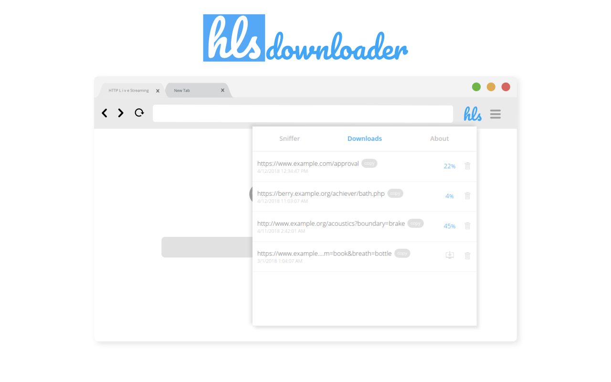

# HLS-downloader

>This extension is completely free and published under the MIT license. However, if you are using it and enjoy it, you are welcome to [making a donation](https://www.paypal.com/cgi-bin/webscr?cmd=_s-xclick&hosted_button_id=9KTFNHLYAJ5EE&source=url
) of your choice.

Google Chrome Extension for sniffing and downloading [HTTP Live streams (HLS)](https://en.wikipedia.org/wiki/HTTP_Live_Streaming)

 

**Table of Contents**
- [Storybook](#storybook)
- [Installation](#installation)
- [Usage](#usage)
- [Contributing](#contributing)
- [Contributor Covenant Code of Conduct](#contributor-covenant-code-of-conduct)
- [Credits](#credits)
- [License](#license)

## Storybook

- `npm install`
- `npm run storybook`

## Installation
 
- `npm install`
- `npm run build`
- Open `chrome://extensions` in Chrome
- Turn on `Developer mode`
- Click `Load unpacked`
- Choose `<REPO_PATH>/build`

## Usage
 
TODO: Write usage instructions
 
## Contributing

[Contributing guideline](./CONTRIBUTING.md)

TL;DR
1. Fork it!
2. Create your feature branch: `git checkout -b my-new-feature`
3. Commit your changes: `git commit -am 'Add some feature'`
4. Push to the branch: `git push origin my-new-feature`
5. Submit a pull request :D

## Contributor Covenant Code of Conduct

[Code of Conduct guideline](./CODE_OF_CONDUCT.md)
 
## Credits
 
Lead Developer - Shy Alter (@puemos)

 
## License
 
The MIT License (MIT)

Copyright (c) 2020 Shy Alter

Permission is hereby granted, free of charge, to any person obtaining a copy of this software and associated documentation files (the "Software"), to deal in the Software without restriction, including without limitation the rights to use, copy, modify, merge, publish, distribute, sublicense, and/or sell copies of the Software, and to permit persons to whom the Software is furnished to do so, subject to the following conditions:

The above copyright notice and this permission notice shall be included in all copies or substantial portions of the Software.

THE SOFTWARE IS PROVIDED "AS IS", WITHOUT WARRANTY OF ANY KIND, EXPRESS OR IMPLIED, INCLUDING BUT NOT LIMITED TO THE WARRANTIES OF MERCHANTABILITY, FITNESS FOR A PARTICULAR PURPOSE AND NONINFRINGEMENT. IN NO EVENT SHALL THE AUTHORS OR COPYRIGHT HOLDERS BE LIABLE FOR ANY CLAIM, DAMAGES OR OTHER LIABILITY, WHETHER IN AN ACTION OF CONTRACT, TORT OR OTHERWISE, ARISING FROM, OUT OF OR IN CONNECTION WITH THE SOFTWARE OR THE USE OR OTHER DEALINGS IN THE SOFTWARE.
